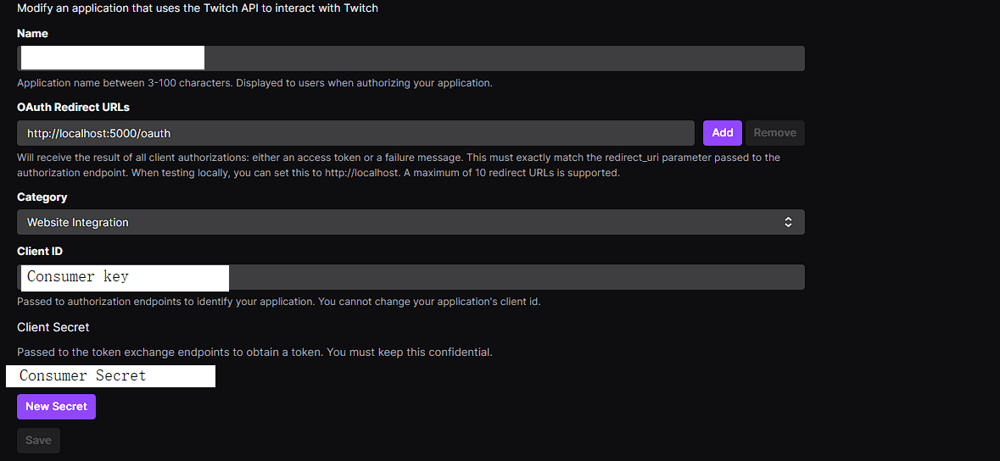
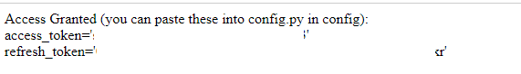

# Clip Hunter
## Download specific events from streams. 

How to run

`pip install -r Requirements.txt`


## Edit configs

change config/config_example.p to config/config.py

```python
#config/config.py

consumer_key = "" # From Twitch
consumer_secret = "" # F rom Twitch
broadcaster = "" 
access_token = '' # From Flask
refresh_token = '' # From Flask
flask_secret_key = '' # Type random shit here

```

## Create a twitch app

[Create A Twitch App](https://dev.twitch.tv/console/apps/create)


Get your consumer_key (client id) and consumer_secret (client secr
et) from there


Set your call back url to http://localhost:5000/oauth

## Run the flask server to get your python credentials

`python.exe -m flask run`

Go to # [http://localhost:5000/login ](http://localhost:5000/oauth)
(note sometimes it'll say your url doesn't match. just type http://localhost:5000/login in a new window to fix. Always works after)
Login.

Get the access_token and refresh_token.




Now you're ready to clip hunt!


You can just start the beasty by running `python monitor_streamer.py`


You can just start the beasty and overwrite the config's broadcaster by running `python monitor_streamer.py someone`


Check out [overwatch_events.py](overwatch_events.py) to customize events